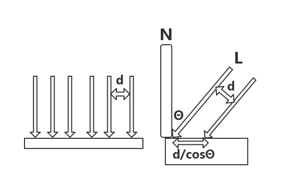
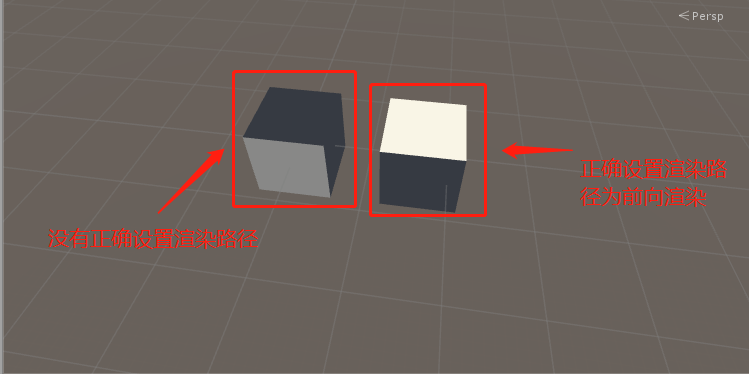
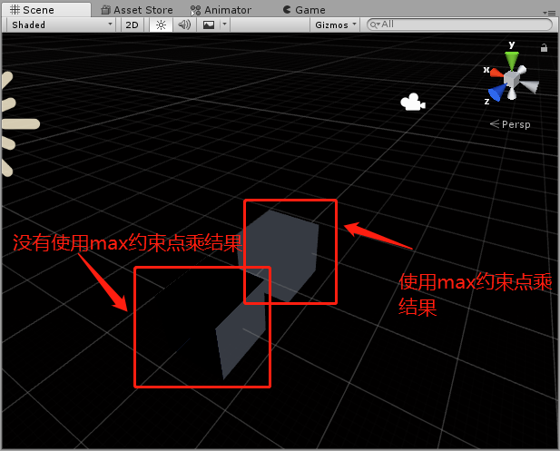
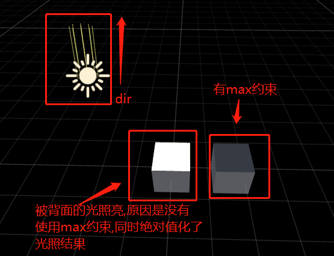

# 标准光照模型之漫反射 #
## 疑难解答 ##
### 1. 为什么漫反射光照结果计算时,要使用归一化的法线以及单位光源方向? ###
首先明确一点，光照的辐照度与cosΘ成正相关，cosΘ表示单位法线与光源方向的夹角，详情如下图。

辐照度通过计算垂直于光的方向的单位面积上单位时间穿过的能量来计算，左图是光源方向垂直于物体的情况，但大多数情况，物体不会与光源垂直，此时情况如右图。

可以明显观察到右图因为光线之间距离变大（由原来的d变为d/cosθ），光线变少，即辐照度变少。

辐照度与d/cosθ成反比，故与cosθ成正比。

当计算漫反射光照结果时，需要用到cosθ，故此时使用法线与光源方向点乘获得cosθ，计算公式如下。

### 2. 为什么Pass中要有Tags{ "LightMode" = "ForwardBase" }这一行？作用是什么？ ###
这一行的作用是设置该Pass的渲染路径。

渲染路径，其决定了光照是如何应用到Unity Shader中的，Unity内置光照的变量随着设置的渲染路径不同而不同。在这个简单的diffuse shader中，其用于填充_LightColor0变量以及正确的光源方向的赋值。

如果不对渲染路径进行设置，会出现错误结果，下图总结了这个错误的结果。

### 3. 为什么要使用max(0,reuslt)来约束漫反射光照结果？ ###
1.max(0,result)用于约束cosθ的结果为正数，需要注意的是，当光源处于物体（某一点）背面时，该点法线与光源方向点乘结果为负数，在最终结果diffuse+ambient中，因为diffuse是负数，会导致物体变暗。如下图所示。

2.第二点，在《Unity Shader 入门精要》中提到：

> 如果不对结果约束为正数，物体会被后面来的光照照亮。

实际测试中发现。。。。。貌似并没有这种现象的产生，在这里我推测一下，有可能是Unity版本不同导致的结果。根据乐乐大神在书中描述的现象，我不负责任的推测一下，可能是由于以前的Unity版本，在光照计算中遇到的负数全部都会自动变成其对应的正数。

下图中，使用了abs函数将光照结果取正值，可以发现物体的确被背面来的光照亮了。

关于这个第二点，只是我的一个个人的小猜测。。。因为在目前查阅的资料了都描述了“会被后面来的光照亮”这一现象。。。。但是我没有遇到，所以想可能是Unity版本的原因。如果大家知道是怎么回事的话，跪求在评论区告诉楼主ORZ超级感激不尽。

