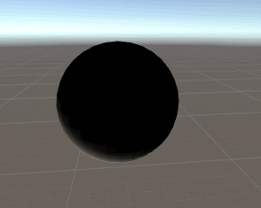
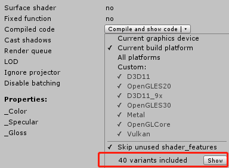

# 《Unity Shader 入门精要》读书笔记 之 渲染路径、阴影 #
## 参考资料 ##
> 《Unity Shader 入门精要》
> 生成多种着色器程序扩展 https://www.cnblogs.com/leiGameDesigner/p/8458898.html
## 渲染路径
### 定义
> 渲染路径(Rendering Path)决定了光照是如何应用到Unity Shader中的。

在Shader中通过指定Pass的LightMode标签来设置渲染路径，如果没有设置渲染路径，绘制的图像将会出错，下图是没有设置渲染路径出现的典型错误。

**个人猜测**，因为渲染路径设置错误，所以导致关于光照的变量（_LightColor0,_WorldSpaceLightPos0）错误，最后使得渲染出来的图像出现了奇怪的错误。

Unity中的渲染路径分为以下三种：

1. 前向渲染
2. 延迟渲染
3. 顶点渲染（已逐步废弃）

其中前向渲染是最常用的渲染路径。

### 前向渲染
前向渲染有两种Pass，Base Pass和Additional Pass。

Base Pass用于处理一个逐像素的平行光以及所有逐顶点和SH光源。

Additional Pass用于处理其他影响该物体的逐像素光源，每个光源执行一次Pass。

#### 为什么Addition Pass中要开启混合？
在Additional Pass中开启混合指令（一般为Blend One One）主要是为了将多个逐像素光源渲染的结果叠加起来。

如果没有开启混合指令，那么后面的光源将会覆盖前面光源的效果，表现出来就是，物体只受到了一个光源的作用。

#### 什么是逐像素、逐顶点光照
逐xx光照实际上表示的是，物体受到光照时，执行的是逐像素的计算还是逐顶点的计算。

这样说可能有点不太明朗，下面上代码。

· 这是逐顶点光照，即光照计算全在顶点着色器中进行

    // 光照是在顶点计算的Shader
    Shader "Volume xx/Other/Vertex Light" {
        Properties {
            _Color("Color Tint",Color) = (1, 1, 1, 1) 
        }
        SubShader {
            Tags { "RenderType"="Opaque" "Queue"="Geometry" }
            Pass {

                Tags { "LightMode"="ForwardBase" }

                CGPROGRAM
                
                #include "Lighting.cginc"

                #pragma vertex vert
                #pragma fragment frag

                fixed4 _Color;

                struct a2v{
                    float4 vertex : POSITION;
                    float3 normal : NORMAL;
                };
                struct v2f{
                    float4 pos : SV_POSITION;
                    fixed4 color : COLOR;
                };

                v2f vert(a2v v){
                    v2f o;
                    o.pos = UnityObjectToClipPos(v.vertex);

                    float3 worldPos = mul(unity_ObjectToWorld,v.vertex).xyz;
                    fixed3 worldNormal = normalize(UnityObjectToWorldNormal(v.normal));
                    
                    fixed3 worldLightDir = normalize(UnityWorldSpaceLightDir(worldPos));

                    // 计算漫反射光照
                    fixed3 diffuse = _Color.rgb * _LightColor0.rgb * max(0,dot(worldLightDir,worldNormal));

                    o.color = fixed4(diffuse,1.0);

                    return o;
                }        

                fixed4 frag(v2f i) : SV_TARGET{
                    return i.color;
                }

                ENDCG
            }
        }
        FallBack "Diffuse"
        
    }

---
· 下面是逐像素（片元）光照，即光照计算全在片元着色器中进行

    // 光照是在顶点计算的Shader
    Shader "Volume xx/Other/Fragment Light" {
        Properties {
            _Color("Color Tint",Color) = (1, 1, 1, 1) 
        }
        SubShader {
            Tags { "RenderType"="Opaque" "Queue"="Geometry" }
            Pass {

                Tags { "LightMode"="ForwardBase" }

                CGPROGRAM
                
                #include "Lighting.cginc"

                #pragma vertex vert
                #pragma fragment frag

                fixed4 _Color;

                struct a2v{
                    float4 vertex : POSITION;
                    float3 normal : NORMAL;
                };
                struct v2f{
                    float4 pos : SV_POSITION;
                    float3 worldNormal : TEXCOORD0;
                    float3 worldPos : TEXCOORD1;                
                };

                v2f vert(a2v v){
                    v2f o;
                    o.pos = UnityObjectToClipPos(v.vertex);

                    o.worldPos = mul(unity_ObjectToWorld,v.vertex).xyz;
                    o.worldNormal = UnityObjectToWorldNormal(v.normal);

                    return o;
                }        

                fixed4 frag(v2f i) : SV_TARGET{
                    fixed3 worldNormal = normalize(i.worldNormal);
                    fixed3 worldLightDir = normalize(UnityWorldSpaceLightDir(i.worldPos));

                    fixed3 diffuse = _Color.rgb * _LightColor0.rgb * max(0,dot(worldNormal,worldLightDir));

                    return fixed4(diffuse,1.0);
                }

                ENDCG
            }
        }
        FallBack "Diffuse"
        
    }

对于前向渲染的Base Pass来说，他处理场景中的一个逐像素的平行光和所有逐顶点、SH（球谐函数，表示暂时不是很理解，此处待补充）光源，这表示的意思可以简单概括如下：

即，逐像素的平行光使得场景内物体都会执行一次逐像素光照计算（如果有在片元着色器计算的话），所有顶点光照的物体（即光照计算在Vertex Shader中的物体）也会进行逐顶点光照计算。

#### 如何支持多光源光照？
如果在前向渲染只使用一个Base Pass，那么它就只能支持一个平行光和其他逐顶点光源，而无法支持多个逐像素光照的情况。

在Base Pass的前提下，在增加一个Additional Pass则可以为物体增加多光源光照的效果。

在Additional Pass中设置渲染路径为LightMode = ForwardAdd和开启混合模式，再将处理顶点光照计算的部分删除，剩余代码跟BasePass一致，就可以达到多光源的效果了。

#### 如何判断光源是逐像素的还是逐顶点
规律如下：

1. 场景中最亮的平行光按逐像素处理
2. 渲染模式设置为Not Important的光源，按逐顶点或SH处理
3. 渲染模式被设置为Important的光源，按逐像素处理
4. 如果根据以上规则得到的逐像素光源数量小于Quality Setting中的逐像素光源数量，会有更多的光源以逐像素的方式进行渲染。

#### multi_compile指令
>Unity中使用multi_compile指令为相应类型的Pass生成所有需要的Shader变种。这些变种会处理不同条件下的渲染逻辑，例如是否使用光照贴图、当前处理那种光源类型、是否开启阴影、光照衰减值的获取。

使用该编译指令需要**谨慎**，因为该指令会大大增加Unity项目的体积，它会生成多个Shader变种。

下图为multi_compile_fwdbase和multi_compile_fwdadd指令生成的shader变种数量，多达40种。

其中用于前向渲染的指令描述如下：

指令 | 描述
---|---
multi_compile_fwdbase | 编译所有Pass类型为ForwardBase 的shader变体。这些变体会处理不同的光线映射类型和主平行光是否有阴影。
multi_compile_fwdadd | 编译所有Pass类型为ForwardAdd 的shader变体。这些编译变体用来处理平行光、聚光和点光类型，并且他们的变体会烘焙贴图。
multi_compile_fwdadd_fullshadows | 与上面的一致，但是还包含了光源实时阴影的处理。
multi_compile_fog | 扩展了几个变体来处理不同的雾类型

#### 光照衰减
平行光没有位置属性，只有方向属性，所以平行光不存在衰减问题。

对于点光源、聚光灯来说，光照强度会随着物体距离他们的距离的变化而改变。

光照衰减值可以采用数学公式计算，但这样会在Shader里出现大量计算，同时无法在Shader中通过内置变量获得**光源的范围、聚光灯的朝向、张开角度等**信息，所以直接采用数学公式计算衰减值不太现实。

Unity使用一张纹理_LightTexture0来在片元着色器中查找逐像素光照的衰减值。

_LightTexture0纹理中对角线上的纹理颜色值表示在光源空间中不同位置的点的衰减值。如（0，0）表示与光源位置重合的点的衰减值，（1，1）表示在光源空间中最远的一点的衰减值。

为了得到给定点在光源中的衰减值，需要将该点通过_LightMatrix0矩阵变换到光源空间来对光照衰减纹理进行采样。

计算衰减值（点光源的衰减值，聚光灯需要另外讨论）的代码如下：

    fixed atten = tex2D(_LightTexture0,dot(lightCoord,lightCoord).rr).UNITY_ATTEN_CHANNEL;

上面的代码使用光源空间中顶点(lightCoord)距离的平方来对纹理进行采样，没有用距离值采样是因为可以避免开方。

## 阴影
