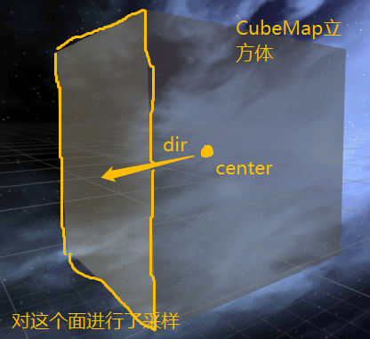
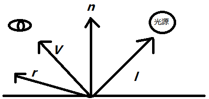
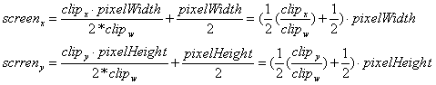
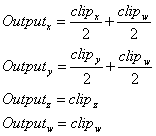
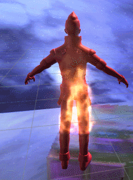

<!-- TOC -->
[1. 《Unity Shader 入门精要》读书笔记 之 立方体纹理、GrabPass](#1-unity-shader-入门精要读书笔记-之-立方体纹理grabpass)
- [1.1. 参考资料](#11-参考资料)
- [1.2. 立方体纹理](#12-立方体纹理)
    - [1.2.1. 反射](#121-反射)
        - [1.2.1.1. 间接光照和直接光照](#1211-间接光照和直接光照)
        - [1.2.1.2. 为什么入射光线处参数选择的是单位视角方向？](#1212-为什么入射光线处参数选择的是单位视角方向)
    - [1.2.2. 折射](#122-折射)
- [1.3. GrabPass](#13-grabpass)
    - [1.3.1. 概述](#131-概述)
    - [1.3.2. 使用方法](#132-使用方法)
    - [1.3.3. 使用要点](#133-使用要点)
        - [1.3.3.1. 如何获得当前片元所在屏幕图像的位置](#1331-如何获得当前片元所在屏幕图像的位置)
        - [1.3.3.2. ComputeGrabScreenPos原理](#1332-computegrabscreenpos原理)
    - [1.3.4. 火焰扭曲效果](#134-火焰扭曲效果)
    - [1.3.5. 玻璃效果](#135-玻璃效果)
<!-- /TOC -->

# 1. 《Unity Shader 入门精要》读书笔记 之 立方体纹理、GrabPass #
## 1.1. 参考资料 ##
> 《Unity Shader 入门精要》    
> Unity Shader-反射效果 https://blog.csdn.net/puppet_master/article/details/80808486  
> 热空气扭曲原理 https://zhidao.baidu.com/question/582761762.html  
> Unity Shader-热空气扭曲效果 https://blog.csdn.net/puppet_master/article/details/70199330
## 1.2. 立方体纹理
与普通的2D纹理不同，立方体纹理包含6个图像，分别表示立方体的5个面。

当要对立方体纹理进行采样时，提供一个方向向量，该向量从立方体纹理中心出发并无限延伸，直到与立方体6个纹理之一相交，采样的结果即交点。

采样原理如下图所示：

### 1.2.1. 反射
基于立方体纹理可以方便的实现简单反射效果，该Shader的关键函数如下：

    float3 reflect(float3 i,float3 n)

表示计算入射光线i关于法向量n的反射方向。reflect函数的原理如下所示(注意该公式的所有向量均为单位向量)：

    r = 2(n·l)n-l

实现反射效果的步骤如下：

1. 根据当前环境生成CubeMap贴图
2. shader根据反射方向对CubeMap进行采样

关键代码：

    float3 reflection = reflect(-o.worldViewDir,o.worldNormal);

其原理是：

> 物体反射到摄像机中的光线方向，可以由光路可逆的原则来方向求得。也就是说，可以计算视角方向关于顶点法线的反射方向来求得如入射光线的方向。

关键代码各向量方向如下图所示：

**概括一下**，**个人理解**，反射就是，当我们对一个能对周围进行反射的物体（如金属材质物体）进行观测时，可以通过反射看到它前方的物体。一个最为典型的例子就是——**镜子**，当我们观察镜子的时候，因为反射的作用，所以我们可以完全观察到我们自身。

#### 1.2.1.1. 间接光照和直接光照

> 反射，应该属于间接光照的范畴，而非直接光照。我们正常计算光的dot（N，L）或者dot（H，N）时计算的均为直接光照，光源出发经过物体表面该像素点反射进入眼睛的光照。然而这只是一部分，该点还可以接受来自场景中所有其他点反射的光照，如果表面光滑，则表面就可以反射周围的环境（如镜面，金属），到那时这个计算相当复杂，相当于需要在该点法线方向对应的半球空间上做积分运算才可能计算完全的间接光照，而且光线与物体碰撞后并不会消亡，而是经过反射或折射，改变方向后继续传递，相当于无限递归  
原文：https://blog.csdn.net/puppet_master/article/details/80808486 

#### 1.2.1.2. 为什么入射光线处参数选择的是单位视角方向？
下面是个人理解。

一开始我对那行代码reflect(-o.worldViewDir,o.worldNormal)相当困惑，因为reflect函数要求填写的是入射光线，为什么这里是视角方向呢，难道不应该是worldLightDir吗？

看了上面那个关于直接光照和间接光照的博文，我觉得，之所以不使用worldLightDir作为入射光线，究其原因**是反射这里根本就不是直接光照产生的效果**，反射应该是场景中其他物体受光照后又反射到当前物体的效果（猜测）。

回到问题本身来，为什么使用视角方向作为参数，在《Unity Shader入门精要》中描述是，**根据光路可逆原则，可以根据最后反射到人眼中的光线来求得入射光线的方向**。然后根据入射光线对CubeMap进行采样模拟反射效果。

### 1.2.2. 折射
当我们从一个介质透过另一个介质观察其中的物体时，会发现其中的图像产生了扭曲的情况，这就是光线折射的表现。

举个例子，当我们看一个筷子在水中的表现时，会发现筷子未浸水的部分表现正常，浸入水的部分出现了明显的弯曲。这就是因为光在水和空气的折射率不同，光线在通过空气斜射入水中时，发生了折射现象。

折射的定义：

> 当光线从一种介质（如空气）斜射入另一种介质（如玻璃）时，传播方向一般会发生改变。

概括一下，**个人理解**，折射就是，当我们观测一个光线进入其中会发生折射的物体（即具有折射特性材质的物体）时（如水面），会发现透过该物体，在该物体后方的图像被扭曲了。

折射关键函数为refract函数，其方法签名如下：

    fixed3 refract(fixed3 i,fixed3 n,fixed eta);

其中i为入射光线，n为入射光线的法线，eta为两个介质折射率的比值，如真空折射率为1，玻璃折射率为1.5，则折射比为1/1.5。需要注意的是，其中i和n都必须为**单位向量**。

基于CubeMap也可以快速做出折射效果，其实现步骤如下：

1. 根据当前环境生成CubeMap贴图
2. 基于refract函数计算经过折射后的向量，根据此向量对CubeMap进行采样

## 1.3. GrabPass
### 1.3.1. 概述
GrabPass是Unity Shader里的一个特殊的Pass，可以用它来获取当前屏幕图像并保存到一张纹理中。

**需要注意的是**，GrabPass的渲染队列要设置在所有不透明物体后面，以保证得到的屏幕图像是正确的。

GrabPass一般用来做玻璃、火焰扭曲等效果。

### 1.3.2. 使用方法
GrabPass通常使用方法如下：

    GrabPass{"_RefractionTex"}

表示的意思是将屏幕图像保存在名为_RefractionTex的二维纹理中。

应用这张二维纹理，可以比较轻松的做出诸如玻璃的的折射、火焰的热浪扭曲效果。

### 1.3.3. 使用要点
除了前面所说的**渲染队列需要格外注意**以外，使用GrabPass还有以下几个要点。

#### 1.3.3.1. 如何获得当前片元所在屏幕图像的位置
使用GrabPass的一个常见目的就是，获得要渲染的物体的位置处的屏幕图像，而不是整张屏幕图像。

这样，就迎来了第一个问题，如何确定当前要渲染的片元对应的屏幕图像的位置。

在Unity Shader里面，可以用ComputeGrabScreenPos这个函数来进行计算,下面是该函数的签名。

    float4 ComputeGrabScreenPos(float4 clipPos)

待输入的参数是在裁剪空间下的顶点坐标，返回的结果值是**当前片元所在屏幕坐标（未进行齐次除法的屏幕坐标）**。

其一个标准的使用方法如下：

    // 顶点着色器
    v2f vert(appdata_base v){
        ....
        o.pos = UnityObjectToClipPos(v.vertex);
        o.screenPos = ComputeGrabScreenPos(o.pos);
        ...
    }
    // 片元着色器
    fixed4 frag(v2f i) : SV_TARGET{
        ....
        // z分量是深度，对于只是获取屏幕图像来说不需要用到
        float2 scrPos = i.screenPos.xy / i.screenPos.w;
        ....
    }

可以看到在顶点着色器中得到的屏幕坐标是没有进行齐次除法的，齐次除法要放到片元着色器中进行，这是因为片元着色器的插值效果。

一个显而易见的点是，在顶点着色器中的变量会经过插值传递到片元着色器中，而ComputeGrabScreenPos计算出来的屏幕坐标如果已经进行了齐次除法，这样就破坏了插值的过程。下面贴一段《Unity Shader入门精要》中的解释。

> 如果在顶点着色器中进行这个除法，那么就需要对x/w和y/w直接进行插值，这样得到的插值结果就会不准确。这是因为我们不可以在投影空间进行插值，因为这并不是一个线性空间，而插值往往是线性的。

#### 1.3.3.2. ComputeGrabScreenPos原理
下面深究一下ComputeGrabScreenPos这个函数。

首先要说明的是，在片元着色器手动进行齐次除法这个操作，相当于我们手工模拟了屏幕映射的过程。现在我们回忆一下屏幕映射是怎么一回事。

首先顶点经过MVP矩阵变换后来到裁剪空间，在裁剪空间下我们需要将顶点映射到屏幕坐标中（即屏幕映射操作），在这个过程中，需要进行齐次除法（即x、y、z分量同除于y分量），进行齐次除法后，顶点就被变换到了一个立方体空间内，此时x、y、z分量的范围是[-1,1]，但是屏幕空间的范围是(0,0)~(screenWidth,screenHeight)，所以我们要将这x、y分量经过 （*0.5+0.5） 的操作后变换到[0,1]的范围内。那么如何确定此时x、y分量所在屏幕的位置呢，其实就是一个缩放的过程，将缩放到[0,1]范围的x、y分量乘于屏幕分辨率，此时得到的x、y分量就是具体的屏幕某一个像素的坐标了。

下面用一个公式描述上述过程。

因为上面的文字描述稍显凌乱，下面用步骤一一写出顶点从裁剪空间到屏幕空间的一系列操作。

1. 顶点经过MVP矩阵变换到裁剪空间
2. 顶点经过齐次除法，坐标变换到NDC（归一化的设备坐标）中，在OpenGL中这个立方体的x、y、z分量范围都是[-1,1]
3. 因为x、y分量与屏幕坐标范围不匹配（一个是[-1,1]，一个是[0,pixelWidth或piexlHeight]），所以将x、y分量转换到[0,1]范围内。（即*0.5+0.5操作，跟半兰伯特很像）
4. 将x、y分量各自乘于pixelWidth、pixelHeight得到这个片元（像素）所在屏幕坐标

而ComputeGrabScreenPos这个函数，实际上就是得到了没有除于w分量的屏幕映射坐标。下面看一下ComputeGrabScreenPos（实际上就是ComputeScreenPos的变种，加上了跨平台的判断条件等等）函数的源码。

    inline float4 ComputeGrabScreenPos (float4 pos) {
        #if UNITY_UV_STARTS_AT_TOP
        float scale = -1.0;
        #else
        float scale = 1.0;
        #endif
        float4 o = pos * 0.5f;
        o.xy = float2(o.x, o.y*scale) + o.w;
    #ifdef UNITY_SINGLE_PASS_STEREO
        o.xy = TransformStereoScreenSpaceTex(o.xy, pos.w);
    #endif
        o.zw = pos.zw;
        return o;
    }

其中ComputeScreenPos函数是ComputeGrabScreenPos函数的简化版，ComputeGrabScreenPos函数最主要是在ComputeScreenPos函数的基础上增加了针对平台差异造成的采样坐标问题。

为了简化问题，下面主要研究ComputeScreenPos函数。

    inline float4 ComputeScreenPos(float4 pos){
        float4 o = pos * 0.5f;

        #if defined(UNITY_HALF_TEXEL_OFFSET)
        o.xy = float2(o.x,o.y*_ProjectionParams.x) + o.w * _ScreenParams.zw;
        #else
        o.xy = float2(o.x,o.y*_ProjectionParams.x) + o.w;
        #endif

        o.zw = pos.zw;
        return o;
    }

其中_ProjectionParams.x默认情况下是1。

上面代码的结果实际是输出了下面这种情况（图片来源于《Unity Shader入门精要》）。

至于说为啥是加上clipw/2，嗯，把Outputx和Outputy除上w分量（齐次除法）你就懂了。

到这里ComputerGrabScreenPos就了解的差不多了。。。基本上可以手写一个出来了，而如何通过当前片元位置计算它所处在的屏幕图像的位置也通过这么一个屏幕映射的操作计算出来了。

### 1.3.4. 火焰扭曲效果
首先看火焰扭曲效果在现实世界的原理：

> 空气局部比较热，导致密度不同，因而对光线的折射率不同。而受热不均匀，引起空气密度的不断变化，光线通过空气时发生的折射就不断变化，就感觉扭曲了一样

在Unity中，可以通过uv偏移来模拟这种热空气扭曲的现象，基本思路如下：

1. 基于GrabPass得到屏幕图像纹理
2. 得到当前像素在屏幕上的位置
3. 基于上一步得到的位置对屏幕图像进行采样
4. 在采样时，对第二步得到的位置根据时间变量_Time进行一定的偏移（此处可以对噪声图采样来得到随机的位置偏移的效果）

效果及对比图如下所示：

左边增加了热空气扭曲效果，右边则没有

  

### 1.3.5. 玻璃效果
在现实世界中，玻璃一般是透明材质，同时，它可以进行环境映射（即反射周围物体），因为介质的不同，透过玻璃观察物体还会发生折射现象。

根据以上特性，可以发现，使用CubeMap和GrabPass可以比较方便的制作玻璃效果。

基本思路是，基于CubeMap来制作反射效果，基于GrabPass来制作折射效果（即uv偏移，这里可以让uv沿着物体法线进行偏移）