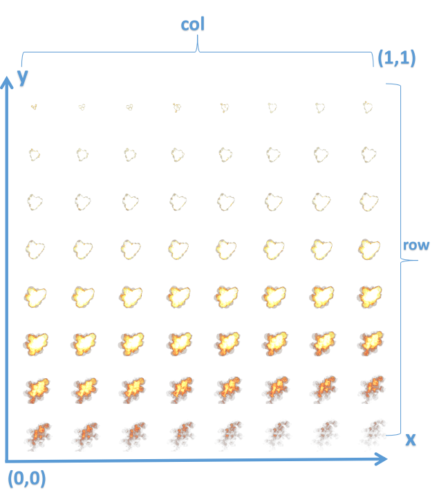
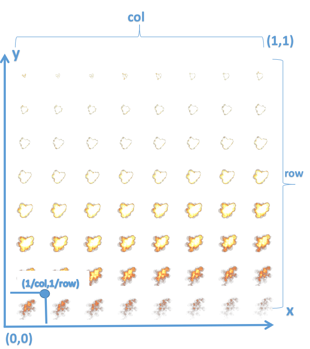
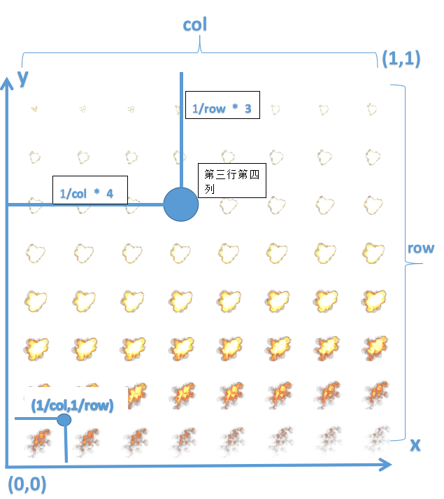
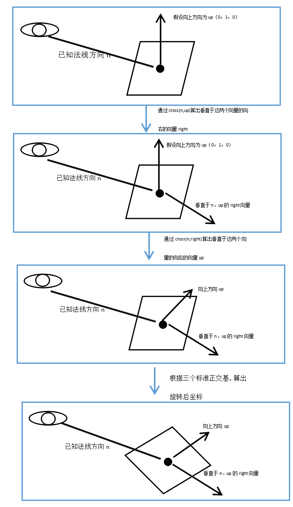

# 《Unity Shader 入门精要》读书笔记 之 顶点变换与_Time变量的使用 #
## 参考资料 ##
> 《Unity Shader 入门精要》  
> 孔杰 billboard效果的实现以及延伸（空间变换、批处理） https://zhuanlan.zhihu.com/p/29072964  
> 作者对广告牌锚点的解释 https://github.com/candycat1992/Unity_Shaders_Book/issues/27
## 序列帧动画
> 最常见的纹理动画就是序列帧动画。序列帧动画的原理非常简单，它像放电影一样，依次播放一系列关键帧图像，当播放速度达到一定数值时，看起来就是一个连续的动画。

一般来说，2D游戏中用的序列帧动画次数比较多，一个常见的序列帧图片如下图所示（来自《Unity Shader入门精要》）。

### 实现
在Shader中实现序列帧还是比较简单的，基本思路就是利用_Time变量，随着时间的变换，不停的变化uv，导致看起来像播放动画一样。

基本思路如下：
根据序列帧的图片，我们设col为图片有多少列，row为图片有多少行，那么一共有col*row个关键帧图片。

那么在实际操作时，就需要把uv分成col*row份，也就是说，uv的范围实际上从(0,0)~(1,1)变换到了(0,0)~(1/col,1/row)。

一个比较形象的示意图如下：

简而言之，我们在frag Shader里得到的uv，x分量要除于col,y分量要除于row,这样,uv就转换到了正确的范围.

但是,这还不够,这样的画,uv只是在序列帧图片的第一幅图上而已,我们要把这个uv平移到我们要到的第N张图上

假设这第N张图的行数是RowN,列数是ColN,那么uv要加上(colN/col,rowN/row),这样才能正确的平移到目标图片上。

假设是第3行第四列的图上，如下图所示，可以看到要平移的部分。

需要注意的是，这张序列帧图片关键帧的顺序是从左到右，从上到下，所以对于uv的y分量，应当减去才是向下一个关键帧前进，如果改为加法，是向上一个序列帧前进。

如上图所示，如果要到达第三行第四列的位置，那么要进行以下操作。

1. 当前uv.x /= col,当前uv.y /= row;
2. 当前uv.x += 4/col,当前uv.y -= 3/row。要不然y也可以加上(row-3)/row,不过对这个分式简化之后也可以发现其实也就是前面那个-3/row
3. 此时uv正确移动到了目标关键帧的位置

### 步骤
那么实现序列帧动画的基本步骤如下：

1. 根据_Time变量确定当前要播放第几行第几列的关键帧
2. 将当前uv根据上面的操作移动到目标关键帧的那个图像范围内
3. 根据uv对图像进行采样

这样，就能简单实现序列帧动画了。

## 广告板（Billboarding）技术
广告版技术就是让某个物体始终面向摄像机的一个技术，下面是《Unity Shader入门精要》对其的描述.

> 广告牌技术会根据视角方向旋转一个被纹理着色的多边形，使得多边形看起来好像总是面对着摄像机。

广告牌技术的优势是显而易见的，对于一些2D的物体，我们只要渲染它的一个面，并让它时时刻刻都面向着摄像机，就能创造出3D的感觉，从而提升了性能。Unity3D中的粒子特效、树等就是基于广告牌技术的。

广告牌的实现有两种方式，一种是在CPU中实现，一种在Shader中实现。下面分别讲述。

### 在CPU实现广告牌技术
在CPU中实现广告牌技术还是比较简单的，那就是可以利用Transform中的LookAt方法，在Update或OnWillRenderObject中使物体时时刻刻的面向摄像机就OK了。

这种方法有一定的局限性，在孔杰的[知乎专栏](https://zhuanlan.zhihu.com/p/29072964),提到：

>脚本挂在物体上，直接改变Transform组件，非常简单。但是当物体是勾选了bacthing static标记，Unity会对他们进行静态合并，经过合并后的Mesh是不能变动的，所以会失去效果。所以我们可以在Shader里面实现这个效果

### 在Shader中实现广告牌技术
在Shader中实现广告牌技术的要点就在于，要将模型的顶点旋转到面向摄像机的方向，这里说到旋转，一般第一个想到的是旋转矩阵，但是实际上这里并不需要用到旋转矩阵。

可以这样理解，旋转后的顶点是处于以一个锚点作为原点，以三个标准正交基（即互相垂直的单位向量）为坐标轴的坐标空间，而我们的目标就是将模型从模型空间变换到目标坐标空间中去。

如果知道了那三个标准正交基、锚点、当前顶点坐标，我们就能将当前顶点转换到**旋转后的坐标空间**中。

#### 关于锚点
锚点可以随意设置，一般可以将其设置为模型空间的原点（0，0，0），**但是！**，如果直接将锚点设置为常量（0，0，0），那么在Shader的编写中就必须**关闭批处理（DisableBatching=true）**。

下面是来自作者issues的解释。

> 因为一旦批处理了就会造成合并网格，那么多个四边形就会合并成一个整体网格里，这个网格的中心就肯定不是每个四边形应有的旋转中心（锚点）了。这就是下面右图的情况。此时每个四边形正确的锚点如红点所示，但模型原点确是绿点。  
> 

对于这种情况，可以用一套纹理存储模型每个顶点到其锚点的距离。此时锚点的位置就等于 顶点位置 + 该顶点到锚点的偏移值。

#### 如何求得三个标准正交基
前面说到，广告牌技术关键是要让物体时刻面向摄影机，那么可以想到，可以让物体的法线方向永远固定为视角方向（当然还有另外一种是固定物体向上的方向的做法），这样玩家看到的就永远是物体的正面了。

那么，接下来可以假定向上的方向为标准正交基的Y轴，当然这个假定的方向不一定跟法线方向垂直，但是现在可以先不管这个，根据法线与向上的方向的叉积，就可以算出标准正交基的X轴，即单位指向右的方向。

将这个算出来的指向右的方向与法线叉积，即可得到正确的向上的方向。

最后，将这三个向量归一化，就得到了三个互相垂直的正交基了。

上述流程可以用下图来表示：

#### 如何求得旋转后的顶点的位置
已知锚点O(x,y,z)，模型空间上一点P(x1,y1,z1)，法线方向n,向上的方向up，向右的方向right，已知法线是顶点旋转后的空间的z轴，向右的方向是空间的x轴，向上的方向是空间的y轴，那么将模型空间中的一点P变换到旋转后的空间中的一点P'的公式如下：

