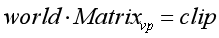
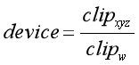
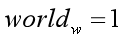
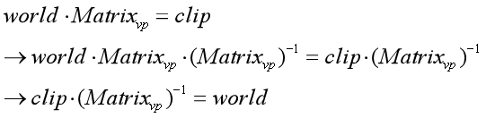
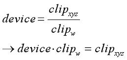
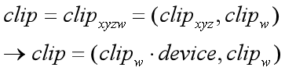
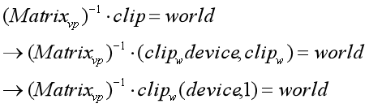
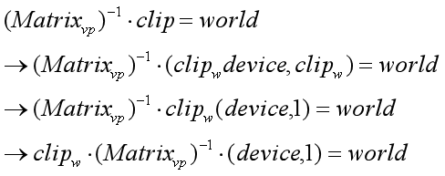
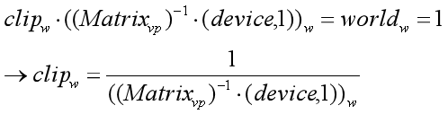
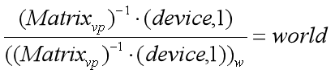

# 从NDC（归一化的设备坐标）坐标转换到世界坐标要点 #
## 参考资料 ##
> How to go from device coordinates back to worldspace http://feepingcreature.github.io/math.html   
> 《Unity Shader入门精要》
## 前情提要，从运动模糊说起
产生运动模糊效果，一般来说有两种做法，第一种是将当前帧和下一帧或上一帧等等图像混合起来作为当前的屏幕图像，这样做法可以导致物体运动时会出现多个残影（因为多个帧混合起来了），可以产生运动模糊效果，但效率不高。

第二种做法是，在Shader里面利用View-Projection矩阵及其逆矩阵获得当前帧和上一帧的世界坐标，通过这两个坐标得到当前像素的运动速度及其方向，再根据这个速度，向这个像素速度方向的N个纹素进行取样并混合，从而产生模糊效果。

而这第二种做法，就是我遇到问题的地方。  
总所周知，在Shader里面，可以根据深度图和当前uv坐标得到当前像素的NDC坐标，那么只要采用View-Projection(视图-裁剪)的逆矩阵就可以将NDC坐标变换到世界坐标下（正是我们所需要的值），按理说，这样应该就可以了，但是我在《Unity Shader入门精要》中看到的计算方法却是下面这样。

    1   fixed4 frag(v2f i) : SV_Target{
    2      // 从深度图中获得深度
    3        float d = SAMPLE_DEPTH_TEXTURE(_CameraDepthTexture,i.uv_depth);
    4      // 根据深度和当前uv坐标反推当前NDC坐标(注意这个坐标已经经过了齐次除法了)
    5        float4 NDCPos = float4(i.uv.x*2-1, i.uv.y*2-1, d*2-1,1);
    6       // 根据NDC坐标及View-Projection的逆矩阵，将NDC坐标变换到世界坐标下
    7       float4 worldPos = mul(_CurrentViewProjectionInverseMatrix,NDCPos);
    8    
    9       worldPos /= worldPos.w;
            ....
            ....
            ....
      }

其中第9行是我最疑惑的内容，按说，你进行屏幕映射要除个w分量进行齐次除法我可以理解，但是你从NDC坐标变换到世界坐标还要除于w是个什么理喔？

百思不得其解之下，翻了下作者的GitHub，嗯，终于找到了答案（感谢作者及评论区的小伙伴！！！）。

在 http://feepingcreature.github.io/math.html 中有详细的数学证明，下面我给翻译一下~~

## 数学推导过程

### 已知条件
首先考虑从世界坐标是如何变换到NDC坐标下的。

很显然，首先世界坐标是通过VP矩阵（不用MVP，因为这里已经是世界坐标了，不用在从模型空间变换到世界空剑侠了）变换到了裁剪空间下，数学公式如下：

在裁剪空间下，通过进行齐次除法将坐标变换到NDC坐标中，公式如下：

最后，第三个已知条件是，世界坐标下的w分量在Unity中定义通常都是1，那么就是下面这样：

### 分析问题
那么，我们的问题就变成了下面这样：

已知：
①

②

③

三个公式,给定一个NDC坐标和一个View-Projection矩阵,求得该NDC坐标所对应的世界坐标.

### 推导

第一步,反转公式③,如下所示:

④

第二步,根据公式2可得:

⑤

同时,又因为clip=(clipxyz,clipw),所以可以根据公式⑤,可得下面的公式:

⑥

根据公式④和⑥,可得下面的公式:

⑦

下面有个解释不是很懂~,原文如下:
> And note that since matrices are linear transforms, we can pull that clip_w in front of the matrix multiply:

大致意思是说,因为矩阵是线性变化的,所以可以把clipw放到矩阵的前面.(老实说clipw不是标量么,放哪里应该都可以把?)

总之,经过上面原文的解释,公式⑦变成下面这样.

⑦

#### clip的w分量怎么得?
那么,一个比较严重的问题就出现了,clip坐标的w分量我们并不知道欸~~~我们已知的只有NDC坐标下的(X,Y,Z)分量(分别可以通过当前像素的uv值和深度算出来).

别急,已知条件不是还有一个没用么,就下面这个已知条件.

①

已知世界坐标的w分量恒为1,根据公式①、⑦，在只关注运算过程和结果的w分量的情况下,有下面这个公式:

⑧

那么，clip的w分量就经过公式⑧算出来了。

#### 最终结果

那么，已知clipw，根据公式⑧和公式⑦，得到下面的公式⑨。

⑨

## 总结

根据公式⑨，就可以知道为什么最后我们还要除于w分量了~~~~~因为下面的分母就是w分量啊。。