# Unity Shader Collections
## 参考资料
> 《Unity Shader 入门精要》
> 大神博客 https://blog.csdn.net/puppet_master
## 简述
这里收录了我学习Shader时模仿或者自制的一些效果，并记录了实现这些效果的技术要点以及我对实现的一些反思与感悟。轻戳**技术要点**就可以看到SJM在写这些效果的时候遇到的各种奇奇怪怪的问题和他的解决方式喔~~~

其中参考的资料都会在原文中提及，如果是将参考资料的一部分原文原封不动的搬过来的话，会像下面这样使用引用符号括起来~

> 这里类比一段摘抄的原文

## Volume 01 Diffuse 基于兰伯特光照模型的漫反射、高光反射光照 -> [技术要点](https://github.com/swordjoinmagic/Sjm-Shader-Collection/tree/master/Volume%2001%20Diffuse%20%E6%BC%AB%E5%8F%8D%E5%B0%84%E5%85%89%E7%85%A7)

1. 逐片元漫反射

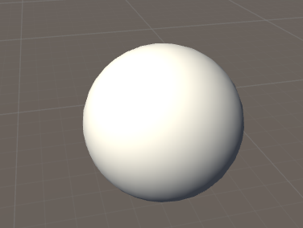

2. 逐顶点漫反射

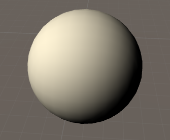

## Volume 02 Texture 纹理的简单应用 -> [技术要点](https://github.com/swordjoinmagic/Sjm-Shader-Collection/tree/master/Volume%2002%20Texture%20纹理的应用)

1. 简单纹理映射

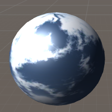

2. 简单法线纹理映射（逐渐加大物体表面凹凸程度）-> [技术要点](https://github.com/swordjoinmagic/Sjm-Shader-Collection/tree/master/Volume%2002%20Texture%20%E7%BA%B9%E7%90%86%E7%9A%84%E5%BA%94%E7%94%A8#%E6%B3%95%E7%BA%BF%E6%98%A0%E5%B0%84)

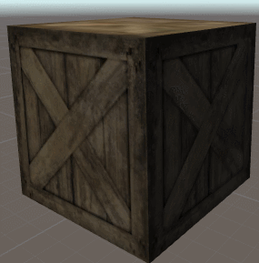

3. 渐变纹理 -> [技术要点](https://github.com/swordjoinmagic/Sjm-Shader-Collection/tree/master/Volume%2002%20Texture%20%E7%BA%B9%E7%90%86%E7%9A%84%E5%BA%94%E7%94%A8#%E6%B8%90%E5%8F%98%E7%BA%B9%E7%90%86)

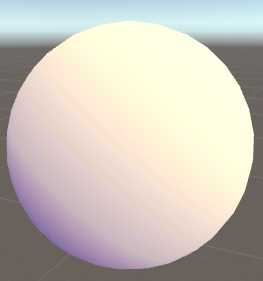

## Volume 03 Alpha 透明效果 -> [技术要点](https://github.com/swordjoinmagic/Sjm-Shader-Collection/tree/master/Volume%2003%20Alpha%20%E9%80%8F%E6%98%8E%E6%95%88%E6%9E%9C)

1. 透明度测试(在立方体上挖洞) -> [技术要点](https://github.com/swordjoinmagic/Sjm-Shader-Collection/tree/master/Volume%2003%20Alpha%20%E9%80%8F%E6%98%8E%E6%95%88%E6%9E%9C#%E9%80%8F%E6%98%8E%E5%BA%A6%E6%B5%8B%E8%AF%95)

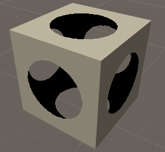

2. 透明度混合 -> [技术要点](https://github.com/swordjoinmagic/Sjm-Shader-Collection/tree/master/Volume%2003%20Alpha%20%E9%80%8F%E6%98%8E%E6%95%88%E6%9E%9C#%E9%80%8F%E6%98%8E%E5%BA%A6%E6%B7%B7%E5%90%88)

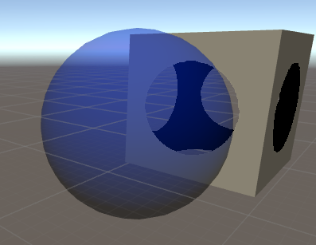

## Volume 04 ForwardRender 渲染路径、阴影 -> [技术要点](https://github.com/swordjoinmagic/Sjm-Shader-Collection/tree/master/Volume%2004%20ForwardRender%E6%B8%B2%E6%9F%93%E8%B7%AF%E5%BE%84%E3%80%81%E9%98%B4%E5%BD%B1)

1. 基于ForwardAdd实现多光源照射 -> [技术要点](https://github.com/swordjoinmagic/Sjm-Shader-Collection/tree/master/Volume%2004%20ForwardRender%E6%B8%B2%E6%9F%93%E8%B7%AF%E5%BE%84%E3%80%81%E9%98%B4%E5%BD%B1#%E5%89%8D%E5%90%91%E6%B8%B2%E6%9F%93)

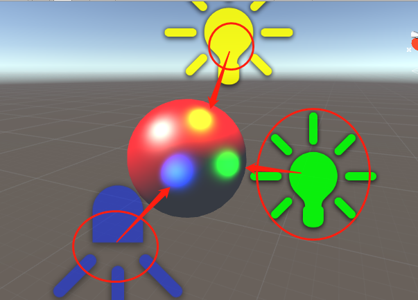

2. 阴影的接受与投影 -> [技术要点](https://github.com/swordjoinmagic/Sjm-Shader-Collection/tree/master/Volume%2004%20ForwardRender%E6%B8%B2%E6%9F%93%E8%B7%AF%E5%BE%84%E3%80%81%E9%98%B4%E5%BD%B1#%E9%98%B4%E5%BD%B1)

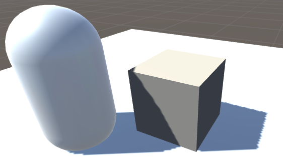

## Volume 05 CubeMap 立方体纹理 -> [技术要点](https://github.com/swordjoinmagic/Sjm-Shader-Collection/tree/master/Volume%2005%20CubeMap%E7%AB%8B%E6%96%B9%E4%BD%93%E7%BA%B9%E7%90%86)

1. CubeMap实现天空盒的反射 -> [技术要点](https://github.com/swordjoinmagic/Sjm-Shader-Collection/tree/master/Volume%2005%20CubeMap%E7%AB%8B%E6%96%B9%E4%BD%93%E7%BA%B9%E7%90%86#121-%E5%8F%8D%E5%B0%84)

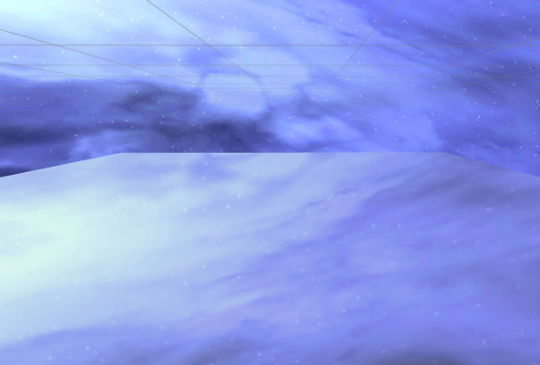

2. 玻璃效果的折射 -> [技术要点](https://github.com/swordjoinmagic/Sjm-Shader-Collection/tree/master/Volume%2005%20CubeMap%E7%AB%8B%E6%96%B9%E4%BD%93%E7%BA%B9%E7%90%86#122-%E6%8A%98%E5%B0%84)

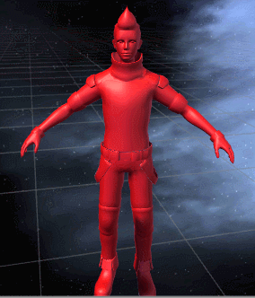

3. 火焰扭曲的折射效果 -> [技术要点](https://github.com/swordjoinmagic/Sjm-Shader-Collection/tree/master/Volume%2005%20CubeMap%E7%AB%8B%E6%96%B9%E4%BD%93%E7%BA%B9%E7%90%86#13-grabpass)

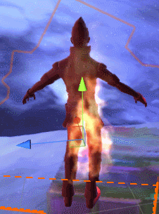

## Volume 06 VertexChange 顶点变换

1. 序列帧动画

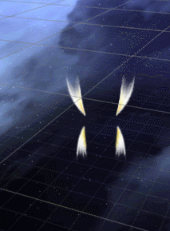

2. 广告板

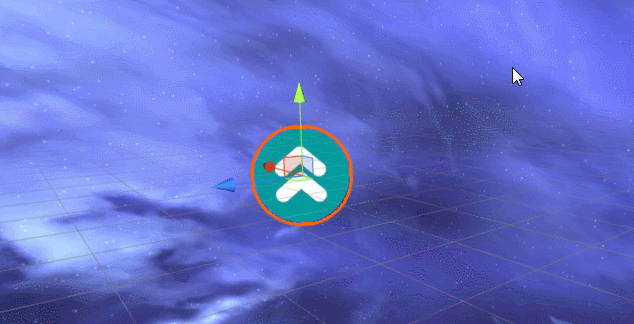

在不使用广告版的情况下是这样的：

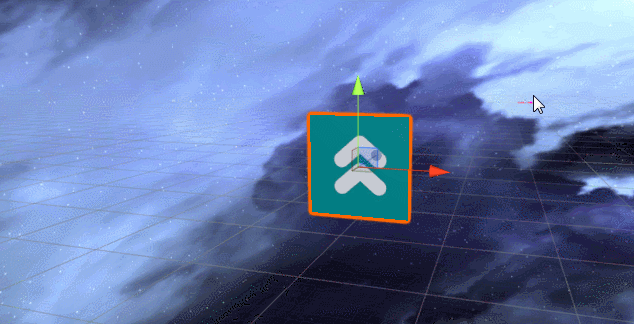

3. 广告板+序列帧动画(可以将2D动画移植到3D游戏中)

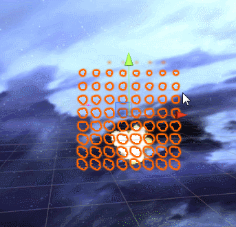

在不使用广告版的情况下是这样的：

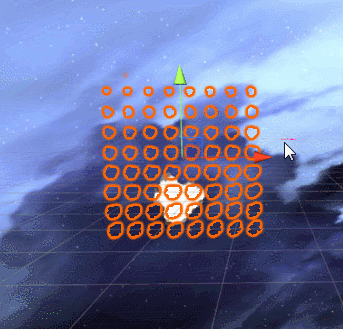

## Volume 07 SimplePostEffect 简单屏幕后处理

原图:

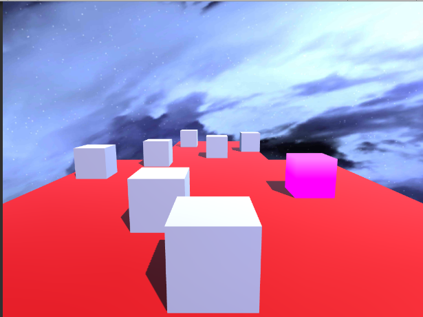

1. 高斯模糊

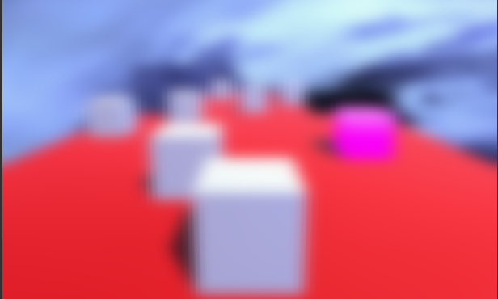

2. Bloom

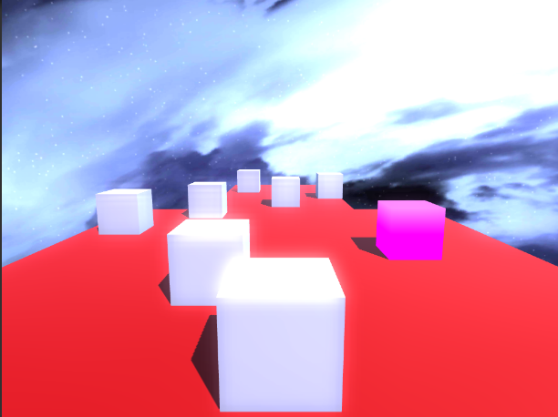

3. 运动模糊（基于当前帧与上一帧混合的方案制作）

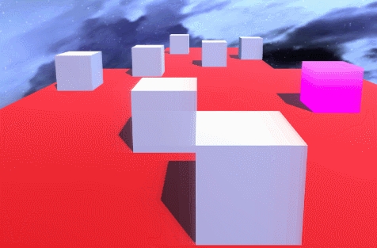

4. 基于边缘检测进行描边(使用屏幕像素值和sobel算子判断边缘)

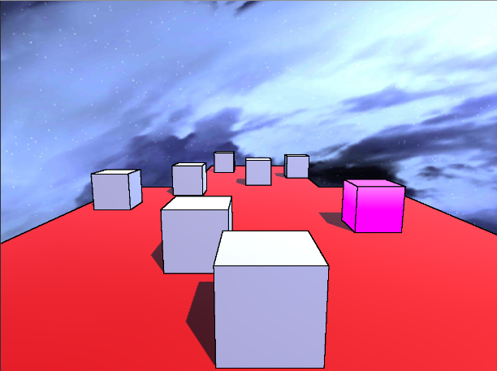

## Volume 08 DepthNormalTexture 深度和法线纹理的简单应用

1. 运动模糊(使用矩阵变换和深度重建世界坐标)

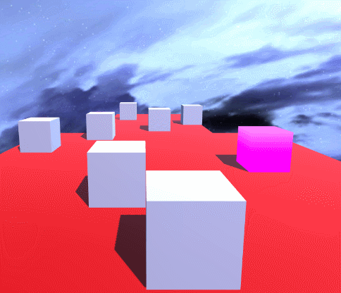

2. 基于高度的雾效(使用射线+摄像机位置+深度重建世界坐标)

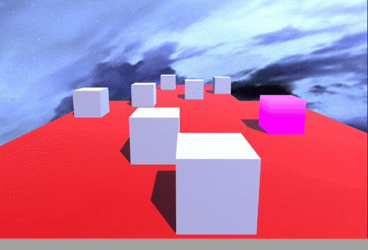

## Volume 09 EdgeDetection 详解边缘检测

1. 基于边缘检测的转场效果(基于噪声、uv变换、边缘检测)

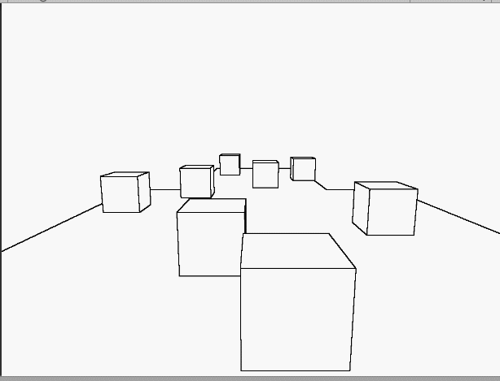

2. 基于边缘检测的子弹时间效果（基于重建世界坐标、噪声、uv变换、边缘检测、mask图）

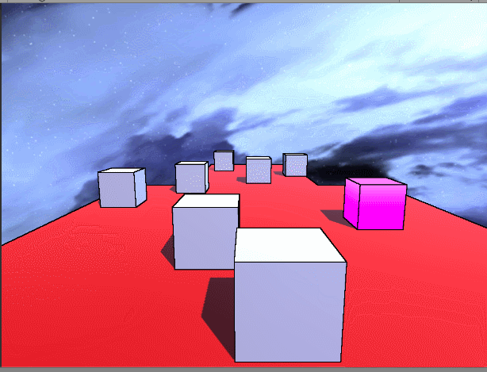
